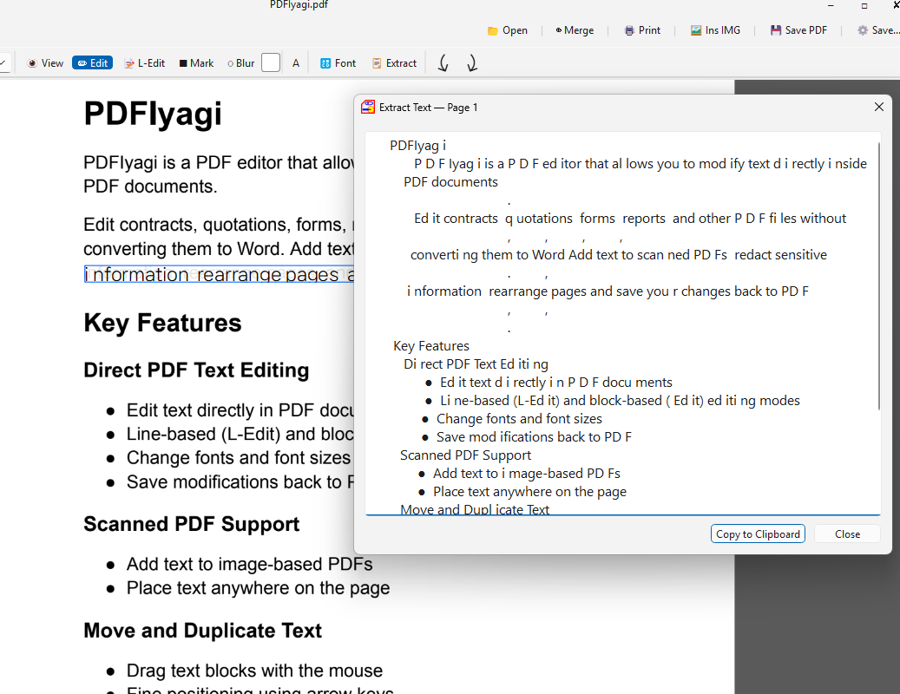
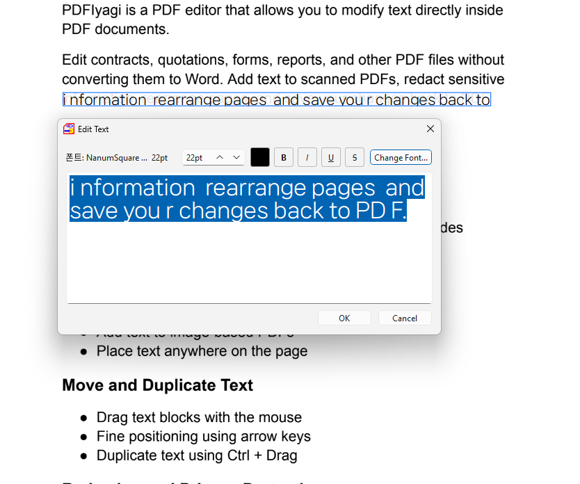

# PDFIyagi v1.17.0


A **lightweight PDF editor** for Windows and Linux.

PDFIyagi lets you edit PDF text, add new text, insert stamp images, redact sensitive information, manage pages, and save documents while keeping edits re-editable.

---

## ✨ Features

### PDF Editing

* **Text editing** — modify existing PDF text directly
* **Re-editable text** — edited text remains editable after saving and reopening
* **Text formatting** — Bold, Italic, Underline, and Strikethrough support
* **Text colors** — choose custom text colors while editing
* **Line Edit mode** — edit entire text lines for paragraph-style documents
* **Field Edit mode** — edit individual text fields for forms and invoices

### Image PDF Support

* **Add text to scanned PDFs** — insert text into image-based documents
* **Insert stamp images** — place signatures, seals, and stamp images anywhere
* **Text above images** — text is always rendered above inserted images
* **Clipboard image paste** — paste images directly from the clipboard
* **Movable image objects** — inserted images remain editable after reopening

### Redaction & Security

* **Black-box redaction** — permanently hide sensitive information
* **Blur redaction** — blur selected regions before saving

### Productivity

* **Undo / Redo** — full Ctrl+Z and Ctrl+Y support
* **Ctrl+Drag duplication** — duplicate text and image objects
* **Text extraction** — extract text from the current page or entire document
* **Document font replacement** — change the font family across the whole PDF
* **Page management** — reorder pages, insert blank pages, and save changes
* **Thumbnail navigation** — quickly browse pages using thumbnails

### Rendering Engines

### Rendering Engines

* **Type 1** — Fast
* **Type 2** — Accurate
* **Type 3** — Best Quality (Recommended)

---

## 🎮 Keyboard Shortcuts

| Key                | Action                            |
| ------------------ | --------------------------------- |
| Ctrl + O           | Open PDF                          |
| Ctrl + S           | Save PDF                          |
| Ctrl + Shift + S   | Save As                           |
| Ctrl + B           | Insert blank page                 |
| Ctrl + I           | Insert image                      |
| Ctrl + V           | Paste image from clipboard        |
| Ctrl + Z           | Undo                              |
| Ctrl + Y           | Redo                              |
| Delete             | Delete selected object            |
| Ctrl + T           | Extract current page text         |
| Ctrl + Shift + T   | Extract entire document text      |
| Ctrl + Shift + F   | Change document font              |
| Ctrl + Mouse Wheel | Zoom in / out                     |
| Left / Right Arrow | Previous / next page              |
| Arrow Keys         | Move selected object by 1 pixel   |
| Shift + Arrow Keys | Move selected object by 10 pixels |
| Ctrl + Drag        | Duplicate text or image object    |

---

## ⬇ Download

### Windows

Install from Microsoft Store.

### Linux

Download the latest release from GitHub Releases.

```bash
chmod +x PDFIyagi
./PDFIyagi
```

---

## 🖥 Supported Platforms

* Windows 10 / 11
* Linux (Ubuntu, Debian and compatible distributions)

---

## 👤 Author

IYAGI INC

Email: [iyagicom@gmail.com](mailto:iyagicom@gmail.com)

GitHub: https://github.com/iyagicom

---

## 📜 License

Copyright (c) 2026 IYAGI INC. All rights reserved.

This software is provided as executable files only. Source code is not publicly available.

Linux version:

You may use, install, package, and redistribute this software freely for any purpose, including personal, commercial, educational, governmental, and organizational use.

Windows version:

Distributed through the Microsoft Store. Usage and licensing are managed through the MS Store.
